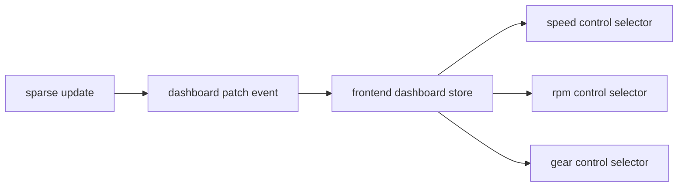

# Dashboard 显示与全链路性能优化计划

日期：2026-06-16  
范围：`acc-coach` 本体、`module_live_telemetry` dashboard 数据链路、`module_local_dashboard` overlay 渲染链路。

## 背景

Local Dashboard 已经从“手动 preview”逐步接入真实 overlay 显示，并开始在 ACC session 中消费 live telemetry。最近调试中暴露出几个典型问题：

1. 不同 telemetry item 使用不同刷新率时，低频字段会偶发显示默认文本 `--`。
2. Local Dashboard 相比 ACC 游戏内 HUD 存在肉眼可见的数据延迟，约 0.2s 到 0.5s。
3. overlay 显示/隐藏状态曾被残留 telemetry frame 干扰，后续已调整为只由 recording/live/paused 状态控制。
4. 当前前端通过 IPC polling 获取 dashboard frame，后端通过 channel 接收 dashboard sparse frame，再缓存给 IPC 读取，链路中存在多处潜在排队、复制、跨线程、跨进程和渲染调度成本。

本文档目标是给出未来专项优化的完整计划。它不是一次性改完的任务清单，而是一个分阶段路线图：先建立可观测性，再稳定语义，再优化延迟，最后优化 CPU/GPU 和前端渲染开销。

## 当前链路概览

现阶段 Local Dashboard 的 live 数据链路大致如下：

```mermaid
flowchart LR
    ACC["ACC shared memory"] --> Reader["module_live_telemetry reader"]
    Reader --> Controller["RecordingController"]
    Controller --> DashSvc["DashboardService"]
    DashSvc --> Sparse["DashboardValuesFrame sparse values"]
    Sparse --> Chan["dashboard_tx / dashboard_rx"]
    Chan --> Monitor["AutoRecordingMonitor latest dashboard cache"]
    Monitor --> IPC["Tauri IPC get_live_dashboard_frame"]
    IPC --> OverlayWindow["LocalDashboardOverlayWindow polling"]
    OverlayWindow --> Renderer["dashboardRenderer"]
    Renderer --> DOM["Overlay DOM / CSS transform"]
```



关键特征：

- `DashboardService` 按 item 独立刷新间隔调度。
- `DashboardValuesFrame.values` 是稀疏结果，只包含本轮到期计算的 item。
- `AutoRecordingMonitor` 现在将稀疏 frame merge 成 latest snapshot，避免不同刷新率导致字段缺失。
- 前端 overlay 以 `frameMs` 配置通过 IPC 轮询数据，当前默认 `frameMs=100`，最小 clamp 为 `33`。
- overlay 显示/隐藏由 recording status 控制，不再由 telemetry frame 新旧程度控制。

## 核心设计原则

### 1. 状态和数据分离

Overlay 是否显示，只能由状态决定：

- recording/live/paused/connected
- overlay enabled
- hide when not live
- preview mode

Telemetry frame 只用于渲染数值，不参与 show/hide 判断。这样可以避免“最后一帧残留数据”让 overlay 误显示。

### 2. 增量输入，快照输出

底层 dashboard service 按 item 频率产生稀疏增量是合理的，因为它可以减少计算和传输。但 UI 渲染需要的是“当前 dashboard 状态”。

因此短中期推荐模型是：

```text
sparse item update -> backend dashboard snapshot -> frontend dashboard store -> controls render
```

这样可以兼容现有渲染器，又能避免字段级 patch 直接暴露给每个控件。

### 3. 最新优先，允许丢旧帧

Dashboard 是 live HUD，不是日志回放。对于显示链路，旧帧没有价值：

- 队列积压时应优先 drain 到最新。
- channel 满时宁可丢旧数据或覆盖缓存，也不要阻塞 live 采样。
- 前端如果处理不过来，应跳帧，而不是追帧。

### 4. 可观测性先于大改

延迟优化不能只凭肉眼估计。专项前应先打通端到端时间戳和统计指标：

- ACC frame timestamp
- dashboard service compute timestamp
- channel receive timestamp
- IPC response timestamp
- frontend receive timestamp
- React commit / paint timestamp

只有能拆分每一段耗时，才能避免把问题修错层。

## 问题 1：不同刷新率导致 `--` 闪烁

### 根因

底层 `DashboardValuesFrame` 是稀疏帧。例如：

```text
t=0ms    values={ speedKmh: 120, rpm: 7000 }
t=8ms    values={ rpm: 7100 }
t=16ms   values={ rpm: 7200 }
t=17ms   values={ speedKmh: 121 }
```

如果前端直接把每一帧当作完整 frame 渲染，那么 `t=8ms` 的 frame 没有 `speedKmh`，速度控件会显示默认 `--`。

### 当前修复

`AutoRecordingMonitor` 已改为维护 latest snapshot：

```text
snapshot={ speedKmh: 120, rpm: 7000 }
receive { rpm: 7100 }
snapshot={ speedKmh: 120, rpm: 7100 }
```

这本质上就是增量更新，只是更新发生在后端统一缓存层，而不是让每个前端控件各自维护 last value。

### 为什么短期不直接在前端做字段级增量

前端字段级增量也可行，但需要引入新的状态模型：

- 需要 dashboard store 维护每个 field 的 last value。
- 每个控件需要按字段订阅或从 store selector 取值。
- 需要处理字段被移除、layout 切换、subscription 变更后的 stale value 清理。
- 需要处理 preview、designer、remote dashboard 等多入口是否复用同一套 store。

后端 snapshot 更适合当前阶段，因为：

- 改动小。
- 不改现有 `LocalDashboardOverlay` 的 frame 输入接口。
- 能统一服务 local/remote/未来 dashboard 端。
- 可以在 subscription replace 时清空 snapshot，避免 stale 字段残留。

### 后续优化方向

长期可以改成“后端推 patch，前端维护 store”：



收益：

- 减少 IPC payload 中重复字段。
- 减少无关控件重渲染。
- 控件可以按字段订阅。
- 可以更精确统计每个字段的更新频率和延迟。

代价：

- 前端状态管理复杂度上升。
- 需要明确字段生命周期。
- 需要为 layout 切换、subscription 变化、连接断开设计 reset 语义。

## 问题 2：显示延迟 0.2s 到 0.5s

### 可疑来源

#### A. dashboard channel 排队

当前 `dashboard_tx/dashboard_rx` 容量曾为 64。若 dashboard service 以 120Hz 产生 frame，64 帧约等于：

```text
64 / 120 = 0.533s
```

这与用户肉眼观察的 0.2s 到 0.5s 延迟高度吻合。

如果 consumer 每次 select 只处理一个 frame，而 producer 持续产出，就可能出现“latest cache 实际缓存的是队列中的旧帧”。

当前已做的缓解：

- 收到 dashboard frame 后，立即 drain `dashboard_rx.try_recv()` 到最新。
- 每个 sparse frame merge 到 latest snapshot。

#### B. IPC polling 间隔

前端 overlay 当前通过 IPC polling 获取 frame。默认 `frameMs=100`，意味着单这一段就可能引入 0 到 100ms 的等待。

即使调到最小 `33ms`，也仍然是 polling 模型：

- 新数据刚错过一次 poll，需要等下一轮。
- IPC 调用本身有序列化、调度和跨线程成本。
- 如果上一轮 IPC 尚未返回，in-flight 防重入会跳过后续轮询。

#### C. Tauri IPC 序列化成本

`get_live_dashboard_frame` 当前返回一个 JSON-like map：

```text
BTreeMap<String, serde_json::Value>
```

每轮 IPC 都需要：

- Rust HashMap/BTreeMap 构建
- key string 分配或复制
- serde_json value 包装
- IPC 序列化
- JS 侧反序列化

字段较少时问题不大；字段增多、刷新率提高后会成为可见成本。

#### D. React 渲染与浏览器 paint

前端收到 frame 后，React state 更新会触发 overlay tree 重新渲染。当前渲染模型是：

- 一个 `frame` state 更新。
- 整个 `LocalDashboardOverlay` 重新 render。
- 每个 dynamic control 调用 `resolveControlText`。
- 条件样式也读取 frame 并计算。

如果控件数量增加，或 frame 更新频率提高，可能出现：

- JS 主线程被频繁占用。
- React commit 延迟。
- 浏览器 paint 合并或跳帧。

#### E. Windows overlay / compositor

Local Dashboard 是独立 overlay 窗口，且可能 topmost、transparent、click-through。Windows DWM 合成、DPI scaling、GPU composition 都可能带来一小段额外延迟。

这通常不是 0.5s 的主因，但在 120Hz 场景下会影响体感。

## 目标指标

建议把专项优化目标拆成多个可量化指标。

### 端到端显示延迟

定义：

```text
frontend_paint_time - telemetry_timestamp
```

目标：

- P50 < 50ms
- P95 < 100ms
- P99 < 150ms

如果受限于 ACC shared memory 自身更新时间或 Windows compositor，可按实测调整。

### 数据链路延迟

定义：

```text
frontend_receive_time - dashboard_service_compute_time
```

目标：

- P50 < 16ms
- P95 < 33ms
- P99 < 66ms

### UI 渲染成本

定义：

```text
React render + commit + browser paint
```

目标：

- 单 frame JS 处理 < 4ms
- 60Hz dashboard 下不阻塞主线程
- 控件数量 50 时仍能稳定显示

### 队列积压

目标：

- dashboard channel backlog 长期接近 0
- 允许短暂 spike，但 consumer 每轮应 drain 到最新
- 不允许通过追旧帧造成 live HUD 延迟

## 阶段 0：可观测性建设

这是优先级最高的阶段。没有端到端 tracing，后续优化容易凭感觉。

### 0.1 定义 dashboard trace id

每个 dashboard update 携带：

- `sampleTick`
- `timestampNs`
- `dashboardSeq`
- `producedAtNs`
- `receivedAtNs`
- `snapshotSeq`

建议新增结构：

```rust
pub struct DashboardSnapshot {
    pub sample_tick: u64,
    pub timestamp_ns: u64,
    pub snapshot_seq: u64,
    pub produced_at_ns: u64,
    pub monitor_received_at_ns: u64,
    pub values: HashMap<String, f64>,
}
```

注意：`produced_at_ns` 应使用单调时钟或统一时钟来源。跨 Rust/JS 边界比较时，应考虑 clock origin 不一致。更稳妥的做法是：

- Rust 内部统计 Rust-to-Rust 延迟。
- 前端内部统计 JS receive-to-paint 延迟。
- 端到端只使用 telemetry timestamp 做近似参考。

### 0.2 后端指标

在 `AutoRecordingMonitor` 记录：

- dashboard_rx received count
- drained frame count
- max backlog
- latest snapshot field count
- last sample tick
- last dashboard timestamp
- channel full/drop count，如果底层可暴露
- replace subscription count
- snapshot reset count

新增 debug IPC：

```rust
get_live_dashboard_debug_stats() -> DashboardDebugStats
```

示例：

```json
{
  "receivedFrames": 12345,
  "drainedFrames": 456,
  "maxBacklog": 32,
  "snapshotSeq": 12001,
  "fieldCount": 18,
  "lastSampleTick": 345678,
  "lastTimestampNs": 12345678900
}
```

### 0.3 前端指标

在 overlay window 记录：

- IPC request start/end
- skipped polls due to inFlight
- frame seq received
- duplicate snapshot count
- render count per second
- average frame payload size
- controls rendered per frame

可以先用 `localStorage.accCoachDashboardLog=1` 控制日志，再演进到 overlay debug panel。

### 0.4 paint 观测

短期可使用：

```ts
requestAnimationFrame(() => {
  // record approximate paint-ready time
});
```

更精细可使用：

- `performance.mark`
- `performance.measure`
- `PerformanceObserver`
- React Profiler

### 0.5 诊断视图

建议在 Dashboard 页面增加一个开发用 diagnostics panel，默认隐藏：

- data rate
- IPC rate
- dropped/skipped poll
- backend backlog
- frontend render FPS
- last frame age
- field count
- active subscriptions

打开方式：

- localStorage flag
- dev build only
- hidden keyboard shortcut

## 阶段 1：语义稳定

### 1.1 明确 snapshot 与 sparse frame 类型边界

当前命名 `get_live_dashboard_frame` 容易混淆。建议逐步改名：

- `DashboardValuesFrame`：底层 sparse frame。
- `DashboardSnapshot`：给 UI 消费的完整快照。
- `DashboardPatch`：未来前端增量 store 用的字段级 patch。

IPC 层建议新增：

```rust
get_live_dashboard_snapshot() -> Option<DashboardSnapshot>
```

旧的 `get_live_dashboard_frame` 可以保留一段兼容期，但内部改为调用 snapshot。

### 1.2 明确字段生命周期

字段值应在以下场景清空：

- recording stop
- shared memory disconnected
- session reset
- dashboard subscription replace success
- overlay disabled
- layout set changed

字段值不应在以下场景清空：

- 某一 sparse frame 没有该字段
- 另一个字段以更高频率更新
- 前端 polling 暂时跳过一轮

### 1.3 明确默认文本语义

`--` 应只表示：

- 字段从未有过有效值
- 当前 dashboard snapshot 不包含该字段且没有 last value
- 字段计算失败且策略是显示默认文本
- 当前没有 frame/snapshot

不应表示：

- 当前 sparse frame 没有更新该字段

### 1.4 计算失败策略

对 calculated item，建议引入 error metadata：

```json
{
  "values": { "speedKmh": 120 },
  "errors": {
    "calc:delta": "missing reference lap"
  }
}
```

UI 可按字段配置：

- keep last value
- show default text
- show error marker
- hide control

## 阶段 2：后端链路优化

### 2.1 Drain 到最新

已完成初步版本：consumer 收到 dashboard frame 后 drain channel 中所有积压 frame，并 merge 到 snapshot。

后续可补充指标：

- 每轮 drain 数量
- max drain burst
- drain 后 snapshot age

### 2.2 替换 bounded channel 为 latest-value channel

对于 live HUD，队列语义并不理想。可以考虑 latest-value cell：

```text
producer writes latest sparse frame / patch
consumer reads latest and clears dirty flag
```

选项：

1. 保留 crossbeam channel，但容量降为 1，并用 try_send/drop-old 策略。
2. 使用 `Arc<Mutex<Option<DashboardValuesFrame>>> + Condvar`。
3. 使用 watch/broadcast channel，如果迁移到 tokio async runtime。
4. 在 `module_live_telemetry` 提供 `LatestDashboardSink`。

推荐短期：

- channel capacity 从 64 调到较小值，例如 4 或 8。
- consumer drain 继续保留。

推荐中期：

- 新增 latest-value sink，dashboard HUD 使用 latest-value；recording/logging 如需完整序列，则使用另一个 sink。

### 2.3 DashboardService 输出 patch batch

当前 sparse frame 已接近 patch，但缺少操作语义。未来可以定义：

```rust
pub struct DashboardPatch {
    pub sample_tick: u64,
    pub timestamp_ns: u64,
    pub seq: u64,
    pub values: HashMap<String, f64>,
    pub removed: Vec<String>,
}
```

`removed` 用于 subscription replace 或 item invalidation，避免 stale value。

### 2.4 减少 HashMap/String 成本

当前每个 frame 使用 string key。优化方向：

- 启动时给每个 dashboard field 分配 numeric id。
- 后端传输 `Vec<(FieldId, f64)>`。
- 前端保留 `fieldId -> name` mapping。

示例：

```rust
pub struct DashboardFieldDef {
    pub id: u32,
    pub name: String,
}

pub struct DashboardPatchV2 {
    pub seq: u64,
    pub timestamp_ns: u64,
    pub values: Vec<(u32, f64)>,
}
```

收益：

- 减少 repeated string allocation。
- 减少 IPC payload size。
- 前端 lookup 更快。

代价：

- 需要 field registry 生命周期。
- layout 改变时需要同步 field definitions。
- 调试日志需要把 id 映射回 name。

### 2.5 计算调度优化

当前每个 item 有独立 interval。未来优化点：

- 按 interval 分 bucket，例如 8ms、16ms、33ms、100ms。
- 同 bucket item 一起计算。
- 避免每帧遍历所有 subscription 判断 due。
- 对 raw item 可直接批量读取，不走通用 compute path。
- 对 calculated item 建依赖图，避免重复读取 raw 值。

### 2.6 Raw item 快路径

速度、转速、油门、刹车、档位属于高频 HUD 字段，应有 raw fast path：

- 提前解析 field path。
- 使用 enum/accessor，而不是每次 string path parse。
- 多个 raw fields 一次性从 `TelemetryFrame` 拿值。

示例：

```rust
enum RawAccessor {
    SpeedKmh,
    Rpms,
    Gear,
    Brake,
    Gas,
}
```

### 2.7 订阅去重与频率合并

同一字段可能被：

- local dashboard
- remote dashboard
- output profile
- calculated item dependency

同时订阅。合并规则应明确：

- 同字段多订阅取最高频率。
- 同 calculated item 多订阅取最高频率。
- reference source 不同则不能简单合并。

当前已有 `merge_dashboard_subscriptions`，后续需要增加更强测试覆盖。

## 阶段 3：IPC 与推送模型优化

### 3.1 从 polling 迁移到 event push

当前：

```text
frontend setInterval -> invoke get_live_dashboard_frame
```

目标：

```text
backend emit dashboard_snapshot/dashboard_patch event -> frontend listener updates store
```

Tauri 可选方案：

- `app.emit("dashboard://patch", patch)`
- window-specific emit，只发给 overlay window
- 后续如使用 plugin/channel 能力，可采用更低开销通道

优点：

- 消除 polling 等待。
- 没有 in-flight polling 重入问题。
- 后端有新数据才发。
- 更接近真实 HUD。

风险：

- 高频 Tauri event 可能有 overhead，需要实测。
- overlay window 不存在或隐藏时需要停止发送。
- preview/main window/local overlay 多窗口订阅要做路由。

### 3.2 Push 频率控制

即使后端 120Hz，也不一定每次都要推给前端。推荐策略：

- 数据采样可 120Hz。
- overlay 推送目标 60Hz 或 display refresh rate。
- 高频字段可以在后端 snapshot 中更新，但前端按 animation frame 合并渲染。

推送规则：

```text
if overlay visible:
    send latest patch at max 60Hz
else:
    do not send patch
```

### 3.3 前端 pull fallback

保留 polling fallback：

- event listener 出错时 fallback 到 `get_live_dashboard_snapshot`
- dev diagnostics 可手动触发 snapshot fetch
- preview 模式可继续 pull，降低实现复杂度

### 3.4 二进制 IPC

长期可评估 binary payload：

```text
header: seq, timestamp, count
body: repeated field_id + f64
```

但这属于后期优化。当前优先级低于：

- drain backlog
- event push
- frontend store
- render memoization

## 阶段 4：前端状态与渲染优化

### 4.1 引入 dashboard store

当前 `LocalDashboardOverlayWindow` 用 React state 保存整个 frame。未来建议引入独立 store：

```ts
type DashboardStore = {
  seq: number;
  timestampMs: number;
  values: Map<string, number>;
  errors: Map<string, string>;
};
```

可选实现：

- `useSyncExternalStore`
- Zustand
- 自定义 event emitter + selector

推荐优先考虑 `useSyncExternalStore`，因为它能和 React 并发渲染模型更好配合，也不强依赖新库。

### 4.2 控件级 selector

每个 dynamic control 解析自己的依赖字段：

```ts
controlDependencies(control) -> string[]
```

控件只订阅自己依赖的字段：

- speed 控件只在 `speedKmh` 变化时更新。
- rpm 控件只在 `rpm` 变化时更新。
- 条件样式依赖额外字段时，把这些字段加入 dependency list。

收益：

- 50 个控件时，不需要每个 frame 重算所有控件文本。
- 高频 rpm 更新不会导致低频 lap time 控件重渲染。

### 4.3 预编译文本模板

当前每次 render 都可能执行模板替换：

```text
"{value|integer}" -> parse -> read field -> format
```

建议 layout load 时预编译：

```ts
type CompiledControlTemplate = {
  parts: Array<TextPart | FieldPart>;
  dependencies: string[];
};
```

渲染时只执行：

```ts
format(compiled.parts, store.values)
```

### 4.4 预编译条件规则

条件样式同理：

- 解析 operator。
- 解析 telemetry field。
- 生成 dependency list。
- 避免每帧遍历和解析无关规则。

### 4.5 控件 memoization

`DynamicDashboardControl` 可拆分为：

- static layout props
- dynamic text/style props

并使用：

- `React.memo`
- selector result equality
- CSS custom properties

### 4.6 CSS transform 与布局稳定

当前 overlay 使用 absolute positioning 和 transform scale。未来需要确认：

- transform 是否导致文本模糊。
- DPI 175% 下 physical/logical size 是否一致。
- 3840x2160 canvas 缩放到 2560x1440 时是否保持坐标准确。

建议保留：

- dashboard logical coordinate system
- display scale
- physical monitor bounds

但需要将这些概念写入明确文档，避免后续再次混用。

### 4.7 requestAnimationFrame 合帧

如果后端 push 频率高于浏览器 paint，前端 store 可以这样处理：

```ts
onPatch(patch) {
  pendingPatch.merge(patch);
  if (!rafScheduled) {
    rafScheduled = true;
    requestAnimationFrame(flushPendingPatch);
  }
}
```

收益：

- 一帧内多个 patch 合并。
- 避免 React 在同一 paint 周期内多次 commit。
- 对高频 telemetry 更稳定。

## 阶段 5：窗口与显示层优化

### 5.1 Overlay 生命周期

Overlay window 应区分：

- created
- hidden
- visible
- preview
- closed

建议：

- app 启动时可创建 overlay window，但保持 hidden。
- live 状态 show。
- paused/stopped hide。
- app exit close。
- preview 使用明确 flag，关闭按钮永远可用。

### 5.2 click-through 切换成本

`set_ignore_cursor_events` 或 Windows click-through style 切换不应在每帧执行。只在以下场景执行：

- preview enter/exit
- config clickThrough changed
- overlay show 时应用一次

### 5.3 bounds 更新节流

窗口 bounds 不应与 telemetry frame 同频更新。建议：

- follow monitor/window bounds：250ms 到 500ms 足够。
- bounds 未变化时不调用 set bounds。
- DPI/display change 事件触发立即更新。

### 5.4 多显示器与 DPI

需要统一四种坐标：

- dashboard logical size，例如 3840x2160。
- monitor physical pixels，例如 3840x2160。
- Windows logical pixels，例如 2194x1234 when 175% scaling。
- webview CSS pixels。

专项中应建立测试矩阵：

| 场景 | 期望 |
| --- | --- |
| 1920x1080 100% | 坐标 1:1 |
| 2560x1440 100% | 按 logical dashboard scale |
| 3840x2160 175% | overlay 与实际屏幕物理位置一致 |
| 双显示器不同 DPI | 选定 monitor 上坐标正确 |
| ACC 全屏/无边框/窗口化 | 不影响 dashboard 坐标 |

## 阶段 6：数据格式与协议演进

### 6.1 Snapshot API

短期推荐：

```ts
type DashboardSnapshot = {
  seq: number;
  sampleTick: number;
  timestampNs: number;
  timestampMs: number;
  values: Record<string, number>;
};
```

兼容当前渲染器时，可以继续 flatten：

```ts
{
  sampleTick,
  timestampNs,
  timestampMs,
  speedKmh,
  rpm,
  "raw:controls.speed_kmh",
  "raw:controls.rpms"
}
```

但长期建议前端显式从 `values` 读取，减少 metadata 和 telemetry field 混在同一对象。

### 6.2 Patch API

中期：

```ts
type DashboardPatch = {
  seq: number;
  sampleTick: number;
  timestampNs: number;
  values: Record<string, number>;
  removed?: string[];
};
```

前端 store 负责：

- merge values
- delete removed
- bump seq
- notify field subscribers

### 6.3 Field ID API

长期：

```ts
type DashboardFieldDefinitions = Array<{
  id: number;
  name: string;
  kind: "raw" | "calculated" | "system";
  displayName?: string;
  unit?: string;
}>;

type DashboardPatchV2 = {
  seq: number;
  sampleTick: number;
  timestampNs: number;
  values: Array<[number, number]>;
  removed?: number[];
};
```

这一步只在 dashboard 字段多、刷新频率高、IPC payload 成为瓶颈时再做。

## 阶段 7：测试计划

### 7.1 后端单元测试

需要覆盖：

- sparse frame merge 成 snapshot。
- 新字段加入。
- 旧字段保持。
- 同字段新值覆盖旧值。
- subscription replace 清空 snapshot。
- stop/disconnect 清空 snapshot。
- drain backlog 后保留最新 timestamp/sample tick。

### 7.2 Dashboard service 测试

需要覆盖：

- 不同 interval item 输出 sparse frame。
- 同 tick 多字段一起输出。
- 高频 item 不影响低频 item last value。
- replace subscriptions 后调度表正确重建。
- channel full 时策略符合“最新优先”。

### 7.3 前端渲染测试

需要覆盖：

- frame 缺字段时，如果 store 有 last value，不显示 `--`。
- field removed 后显示 `--`。
- layout 切换后旧字段不污染新 layout。
- condition rule 只依赖指定字段。
- text template 预编译结果正确。

### 7.4 集成测试

构造模拟 dashboard stream：

```text
rpm 120Hz
speed 60Hz
gear 20Hz
lap delta 10Hz
```

验证：

- 速度不闪 `--`。
- 各字段更新频率符合订阅。
- snapshot age 不超过目标阈值。
- 前端 render count 不超过预期。

### 7.5 手工测试矩阵

| 测试 | 目标 |
| --- | --- |
| 只显示 speed/rpm | 验证基础延迟 |
| 50 个控件 | 验证渲染压力 |
| 120Hz rpm + 60Hz speed | 验证稀疏 merge |
| 暂停/恢复 | 验证状态控制 |
| 退出 session | 验证 overlay hide 和 snapshot clear |
| preview | 验证不影响 live 状态 |
| 3840x2160 + 175% scaling | 验证坐标和 DPI |

## 阶段 8：实施路线

### Milestone A：稳定当前链路

目标：

- 不闪 `--`。
- 暂停/退出显示状态正确。
- 延迟不出现 0.5s 级别队列滞后。

工作项：

1. 后端 snapshot merge。
2. dashboard_rx drain 到最新。
3. subscription replace 清空 snapshot。
4. 补充 snapshot merge 单测。
5. 增加 dashboard debug stats。

验收：

- 速度/转速不同刷新率时不闪默认文本。
- 队列 backlog 日志长期接近 0。
- 退出 session 后 snapshot 清空。

### Milestone B：建立端到端 metrics

目标：

- 能量化每段延迟。
- 能确认 0.2s 到 0.5s 是否仍存在，以及来自哪里。

工作项：

1. 后端 snapshot seq 与 timestamps。
2. IPC response 加 trace metadata。
3. 前端 receive/render/pain-ready metrics。
4. dashboard diagnostics panel。

验收：

- 能在日志或 panel 中看到 backend age、IPC age、frontend render age。
- 能导出一段 session 的 dashboard latency summary。

### Milestone C：降低前端 polling 延迟

目标：

- 在不大改架构的情况下，把 polling 延迟压低。

工作项：

1. 默认 `frameMs` 从 100 调整到 33，或随 high-frequency dashboard 自动调低。
2. 保留 in-flight 防重入。
3. duplicate snapshot 不触发 React state 更新。
4. overlay hidden 时停止 frame polling。

验收：

- P95 frontend receive interval 接近 33ms。
- CPU 没有明显上升。
- overlay hidden 时没有 frame polling。

### Milestone D：事件推送原型

目标：

- 验证 Tauri event push 是否比 IPC polling 更低延迟。

工作项：

1. 后端对 overlay window emit dashboard patch/snapshot。
2. 前端 listener 更新 store。
3. 保留 polling fallback。
4. 对比 polling vs push 的延迟和 CPU。

验收：

- push 模式 P95 延迟明显低于 polling。
- 没有 event storm。
- overlay hidden 时不发送。

### Milestone E：前端 dashboard store

目标：

- 控件按字段依赖更新。
- 高频字段不拖累低频控件。

工作项：

1. 引入 dashboard store。
2. 编译 control dependency。
3. 控件级 selector。
4. text template 预编译。
5. condition rule 预编译。

验收：

- 50 控件场景下 JS render 成本稳定。
- rpm 120Hz 不导致所有控件 120Hz 重渲染。
- layout 切换无 stale value。

### Milestone F：协议与底层优化

目标：

- 在字段数量和刷新率继续增加时仍有余量。

工作项：

1. field id registry。
2. patch binary 或 compact JSON。
3. raw item fast path。
4. dashboard service interval bucket。
5. latest-value sink 替换 queue。

验收：

- payload size 显著下降。
- 后端 dashboard compute cost 下降。
- 120Hz 高频 HUD 仍稳定。

## 风险与取舍

### Push 不一定一定比 polling 好

Tauri event push 会减少等待，但高频事件本身也有成本。必须用 metrics 验证，不应先入为主。

### 过早 field id 化会增加复杂度

当前 dashboard 字段数量还不大，字符串 key 的可调试性很有价值。field id 应该等 payload/CPU 明确成为瓶颈后再做。

### 前端 store 会提高架构复杂度

控件级订阅能提高性能，但也会带来更多生命周期问题。应在 snapshot API 和 metrics 稳定后再推进。

### 不能牺牲 recording 正确性

Dashboard 显示可以丢旧帧，但 recording 数据不能丢。需要明确 live HUD sink 与 recording persistence 的边界，不能为了 HUD 延迟影响文件录制。

## 推荐的近期下一步

1. 继续观察当前 snapshot merge + drain 后的实际延迟。
2. 增加 dashboard debug stats IPC 和简单前端 diagnostics panel。
3. 将 overlay `frameMs` 暴露到 UI 或根据 dashboard 高频字段自动提示调整。
4. 做一次专项测试：rpm 120Hz、speed 60Hz、gear 20Hz、50 控件、3840x2160 175% DPI。
5. 根据 metrics 决定下一步是降低 polling 间隔，还是直接做 event push prototype。

## 当前结论

短期最有收益的优化是：

- 保持后端 latest snapshot。
- drain dashboard channel 到最新。
- 建立 latency metrics。
- 降低或替换 frontend polling。

中长期最理想的架构是：

```mermaid
flowchart LR
    ACC["ACC shared memory"] --> Controller["RecordingController"]
    Controller --> DashSvc["DashboardService"]
    DashSvc --> Patch["DashboardPatch / latest-value sink"]
    Patch --> Monitor["DashboardSnapshot/Patch broker"]
    Monitor --> Push["Tauri event push"]
    Push --> Store["Frontend dashboard store"]
    Store --> Selectors["Control field selectors"]
    Selectors --> Controls["Memoized controls"]
    Controls --> Paint["Browser paint"]
```



这个架构的核心不是“全量还是增量”二选一，而是分层：

- 采样层：高频、最新优先。
- 计算层：按 item interval 输出 sparse patch。
- 后端 broker：维护 snapshot，负责生命周期和订阅。
- 传输层：尽量 push patch，避免 polling 和旧帧排队。
- 前端 store：字段级 merge，控件级订阅。
- 渲染层：按 animation frame 合帧，避免无关重渲染。

这样才能同时满足：

- 不闪默认值。
- 延迟低。
- 控件多时仍稳定。
- 状态显示逻辑清晰。
- 后续 remote dashboard / tablet dashboard 也能复用同一条数据链路。
