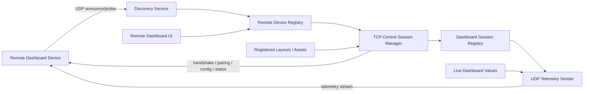
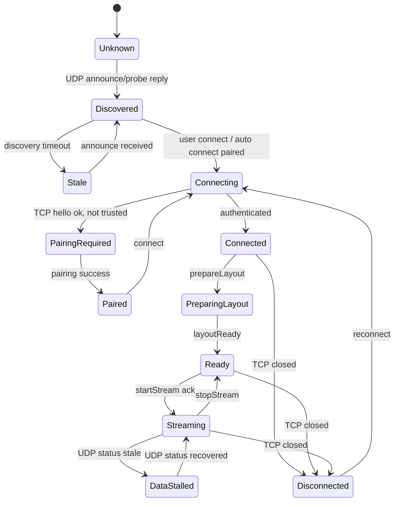

# Network Remote Dashboard 发现与通信协议设计

日期：2026-06-17  
范围：`acc-coach` 桌面端、Network Remote Dashboard 设备端、remote dashboard 发现/连接/状态/数据链路。  
目标：重建 network remote dashboard 的完整发现和通信模型，将命令、状态通信链路与高频数据通信链路分离，使远端 dashboard 可以被可靠发现、配对、连接、配置、监控和流式接收 telemetry。

## 背景

当前 network remote dashboard 更接近一个手工配置的 UDP 输出 profile。桌面端读取 `output_profiles.json`，根据 `networkRemoteEnabled` 和 profile `enabled` 筛选 UDP target，然后把 telemetry/layout packet 直接 `send_to(host:port)`。默认 target 是 `255.255.255.255:20777`，但桌面端并不知道是否真的有设备在线，也没有 ACK、heartbeat、pairing、连接状态、丢包统计或设备能力协商。

这会带来几个结构性问题：

- 发现和发送混在一起。向广播地址发数据不等于发现设备。
- 在线状态不可验证。当前 remote dashboard 订阅侧的 `remote_dashboard_device_connected` 仍是占位逻辑。
- layout、资源、命令和 telemetry 都被压到同一类 UDP 包里，可靠性语义不清晰。
- 用户无法区分“设备没发现”“发现但未连接”“连接但未开始流”“正在流但 UDP 丢包严重”。
- 后续支持多个设备、不同 layout、不同刷新率和不同编码时，现有 `OutputProfile == UDP target` 的模型会变得很脆。

新的设计应明确区分：

- 发现层：找到 LAN 内可连接的 remote dashboard 设备。
- 控制/状态层：可靠地建立会话、下发配置、同步状态、处理错误。
- 数据层：低延迟、高频、允许丢旧帧的 telemetry 流。

## 设计原则

### 1. 控制面和数据面分离

命令、配置、状态、ACK、错误和资源传输走 TCP。  
Telemetry、dynamic dashboard values 等高频数据走 UDP。

TCP 负责“确定性”：设备是否在线、是否已配对、当前使用哪个 layout、是否已开始 streaming、资源是否完整收到。  
UDP 负责“实时性”：最新 dashboard 数值优先，允许丢帧，不重传旧 telemetry。

### 2. TCP 连接是在线状态的权威来源

设备是否 connected 由 TCP control session 决定。  
UDP 数据面的接收统计只表示链路质量，不决定设备是否在线。

如果 TCP 断开，桌面端应立即停止向该设备发送 UDP stream，并把设备状态降级为 disconnected 或 stale。

### 3. Discovery 只发现候选设备，不自动信任

UDP announce/probe 只能说明某个 IP 上有设备声称支持 remote dashboard。  
真正进入 usable 状态必须经过 TCP handshake、协议版本协商和 pairing/trust 校验。

### 4. 数据层只传可丢弃的实时数据

Layout、字体、图片、profile 配置、channel 列表、start/stop stream、设备状态和错误都不应通过 UDP 传递。  
UDP 只传 telemetry frame、dashboard dynamic values、可周期性重发的 lightweight snapshot。

### 5. 多设备是一等公民

数据模型应支持同时发现和连接多个 dashboard 设备。每个设备可以绑定不同 layout、stream profile、refresh rate 和 encoding。不要再把一个 `OutputProfile` 当作一个远端设备。

## 总体架构



建议在桌面端拆出四个核心模块：

- `remote_discovery`：UDP probe/announce 收发、设备去重、last seen 管理。
- `remote_control`：TCP control session、framing、handshake、pairing、心跳、状态处理。
- `remote_session`：device、layout、profile、stream session 的绑定关系和状态机。
- `remote_data`：UDP telemetry stream 编码、序列号、发送节流、统计。

## 角色和端口

### 桌面端

桌面端是 control client 和 data sender：

- 监听 UDP discovery announce。
- 主动发送 UDP discovery probe。
- 主动连接设备 TCP control port。
- 通过 TCP 下发 layout/profile/start/stop。
- 向设备 UDP data port 发送 telemetry stream。
- 聚合设备 TCP status 和 UDP 质量统计，展示到 UI。

### 设备端

设备端是 discovery advertiser、control server 和 data receiver：

- 启动后绑定 TCP control port。
- 绑定 UDP data port。
- 周期性发送 UDP announce。
- 响应桌面端 UDP probe。
- 接受桌面端 TCP control 连接。
- 接收 TCP layout/profile/config。
- 接收 UDP telemetry stream 并渲染。
- 通过 TCP 回报状态、错误和 UDP 接收质量。

### 端口建议

端口应可配置，但建议提供默认值：

- UDP discovery port：`20776`
- TCP control port：设备端默认 `20778`
- UDP data port：设备端默认 `20779`

桌面端 UDP data sender 使用 ephemeral local port 即可。发现层和数据层不要复用同一个 UDP port。

## 发现层

### 协议选择

首版建议使用 UDP broadcast 或 multicast。考虑 Windows 防火墙和普通家庭局域网兼容性，可以同时支持：

- IPv4 broadcast：`255.255.255.255:20776`
- subnet-directed broadcast：例如 `192.168.1.255:20776`
- 可选 multicast：例如 `239.207.76.1:20776`

实现时建议优先 broadcast，接口允许后续添加 multicast/mDNS，不要把 discovery 逻辑写死到单个地址。

### Announce

设备端每 1s 或 2s 发送一次 announce。桌面端收到 announce 后，以 UDP source IP 作为设备 IP，payload 中的 address 只作为显示或调试信息。

```json
{
  "schema": "acc-coach.remote-dashboard.discovery.v1",
  "type": "announce",
  "protocolVersion": 1,
  "deviceId": "rd-01HR7YM3Q3X5K4Z9T2W8P6",
  "deviceName": "Pit Tablet",
  "instanceId": "boot-01HR7Z0W9J6N3V",
  "appVersion": "0.1.0",
  "platform": "android",
  "control": {
    "transport": "tcp",
    "port": 20778
  },
  "data": {
    "transport": "udp",
    "port": 20779
  },
  "capabilities": {
    "maxHz": 60,
    "encodings": ["json", "binary_v1"],
    "layoutAssets": true,
    "maxLayoutBytes": 26214400,
    "maxUdpPayloadBytes": 1200
  }
}
```

字段说明：

- `deviceId`：稳定设备 ID，卸载重装前应保持不变。用于识别同一台设备。
- `instanceId`：本次进程启动 ID。设备重启后变化，用于识别旧 session 已失效。
- `deviceName`：用户可读名称。
- `control.port`：设备 TCP control server 端口。
- `data.port`：设备 UDP telemetry receiver 端口。
- `capabilities`：设备能力，用于 UI 显示和后续协商。

### Probe

桌面端在以下时机发送 probe：

- app 启动。
- 打开 Remote Dashboard 页面。
- 用户点击 refresh。
- discovery registry 为空且 network remote enabled。
- 网络接口变化。

```json
{
  "schema": "acc-coach.remote-dashboard.discovery.v1",
  "type": "probe",
  "protocolVersion": 1,
  "desktopInstanceId": "desktop-01HR7Z12ABCD",
  "requestedCapabilities": ["control_tcp", "data_udp"]
}
```

设备收到 probe 后应立即回 announce，不必等下一次周期 announce。

### 设备去重和超时

桌面端 discovery registry 使用 `(deviceId, sourceIp)` 或优先 `deviceId` 去重。推荐规则：

- 同一个 `deviceId` 从同一个 IP 出现：更新 `lastSeen` 和 payload。
- 同一个 `deviceId` 从新 IP 出现：更新 IP，标记为 `networkChanged`，断开旧 control session。
- 同一个 IP 出现不同 `deviceId`：视为不同设备或设备重装。

状态时间窗建议：

- `lastSeen <= 5s`：`discovered`
- `5s < lastSeen <= 15s`：`stale`
- `lastSeen > 15s`：从 active discovery list 隐藏，但保留已配对设备记录

发现状态不等于连接状态。UI 应分别展示 discovery freshness 和 control session state。

## 控制/状态层

### TCP framing

建议使用 length-prefixed JSON frame：

```text
u32_be length
utf8_json_payload
```

优点：

- 实现简单。
- 可跨 Rust、Android、WebView、embedded Linux。
- 避免 newline-delimited JSON 中字符串换行或粘包问题。
- 后续可在 frame header 中增加 flags 或 binary payload type。

单个 control frame 默认限制建议：

- 普通命令：`<= 256 KiB`
- layout asset chunk：`<= 1 MiB`
- 超限立即返回 protocol error 并断开连接

### Handshake

TCP 连接建立后，桌面端先发 `hello`。

```json
{
  "schema": "acc-coach.remote-dashboard.control.v1",
  "type": "hello",
  "messageId": "msg-1",
  "protocolVersion": 1,
  "desktopInstanceId": "desktop-01HR7Z12ABCD",
  "appVersion": "0.1.0",
  "supportedEncodings": ["json", "binary_v1"],
  "supportedDataTransports": ["udp"],
  "requestedDeviceId": "rd-01HR7YM3Q3X5K4Z9T2W8P6"
}
```

设备回复 `helloAck`。

```json
{
  "schema": "acc-coach.remote-dashboard.control.v1",
  "type": "helloAck",
  "replyTo": "msg-1",
  "messageId": "msg-2",
  "protocolVersion": 1,
  "deviceId": "rd-01HR7YM3Q3X5K4Z9T2W8P6",
  "deviceName": "Pit Tablet",
  "instanceId": "boot-01HR7Z0W9J6N3V",
  "capabilities": {
    "maxHz": 60,
    "encodings": ["json", "binary_v1"],
    "layoutAssets": true,
    "maxLayoutBytes": 26214400,
    "maxUdpPayloadBytes": 1200
  },
  "data": {
    "transport": "udp",
    "port": 20779
  }
}
```

如果版本不兼容，设备回复：

```json
{
  "type": "error",
  "replyTo": "msg-1",
  "code": "unsupported_protocol",
  "message": "Protocol version 1 is not supported"
}
```

### Pairing 和 trust

建议支持已配对设备和首次配对设备两种状态。

首次连接：

1. 桌面端发现设备，UI 显示 `Not Paired`。
2. 用户点击 Pair。
3. 桌面端发 `pairRequest`。
4. 设备端显示确认码或确认弹窗。
5. 设备端回 `pairChallenge` 或 `pairConfirmRequired`。
6. 用户在桌面端输入 PIN，或在设备端点击确认。
7. 配对成功后，双方保存 trust token。

示例：

```json
{
  "type": "pairRequest",
  "messageId": "msg-3",
  "desktopName": "ACC Coach Desktop",
  "desktopInstanceId": "desktop-01HR7Z12ABCD"
}
```

```json
{
  "type": "pairResult",
  "replyTo": "msg-3",
  "messageId": "msg-4",
  "paired": true,
  "deviceId": "rd-01HR7YM3Q3X5K4Z9T2W8P6",
  "trustToken": "opaque-token-issued-by-device"
}
```

后续连接：

```json
{
  "type": "authenticate",
  "messageId": "msg-5",
  "deviceId": "rd-01HR7YM3Q3X5K4Z9T2W8P6",
  "trustToken": "opaque-token-issued-by-device"
}
```

安全边界说明：

- 首版可以使用 opaque token，重点是避免任意 LAN 设备自动接收 telemetry。
- 后续如需要更强安全性，可以把 trust token 升级为 challenge-response，避免 token 明文重放。
- 不建议首版引入 TLS，除非设备平台已经有成熟证书管理方案。协议结构应预留 future `secureTransport` capability。

### 命令消息

控制层使用 request/reply 语义。每个需要确认的命令包含 `messageId`，回复包含 `replyTo`。

核心命令：

- `getStatus`
- `setDeviceName`
- `prepareLayout`
- `putAssetChunk`
- `commitLayout`
- `setStreamProfile`
- `startStream`
- `stopStream`
- `pauseStream`
- `resumeStream`
- `ping`

通用 ACK：

```json
{
  "type": "ack",
  "replyTo": "msg-10",
  "messageId": "msg-11",
  "status": "ok"
}
```

通用 error：

```json
{
  "type": "error",
  "replyTo": "msg-10",
  "messageId": "msg-11",
  "code": "layout_asset_missing",
  "message": "Font asset font-aabbcc was not received"
}
```

### Layout 和资源传输

Layout 和资源必须走 TCP。推荐分三步：

1. `prepareLayout`：发送 layout metadata、asset manifest、static image metadata。
2. `putAssetChunk`：按 asset sha256 分 chunk 发送字体、图片等资源。
3. `commitLayout`：设备校验 sha256、构建渲染状态，成功后 ACK。

`prepareLayout` 示例：

```json
{
  "type": "prepareLayout",
  "messageId": "msg-20",
  "layoutId": "layout-main",
  "layoutVersion": "sha256-layout-json",
  "canvas": {
    "width": 1280,
    "height": 720
  },
  "dynamicControls": [
    {
      "controlId": "speed",
      "fieldRefs": ["speedKmh"],
      "refreshHz": 30
    }
  ],
  "assets": [
    {
      "assetId": "font-aabbcc",
      "kind": "font",
      "mime": "font/ttf",
      "sha256": "aabbcc...",
      "byteLength": 124000
    }
  ]
}
```

`putAssetChunk` 示例：

```json
{
  "type": "putAssetChunk",
  "messageId": "msg-21",
  "assetId": "font-aabbcc",
  "sha256": "aabbcc...",
  "chunkIndex": 0,
  "chunkCount": 4,
  "base64": "..."
}
```

`commitLayout` 示例：

```json
{
  "type": "commitLayout",
  "messageId": "msg-25",
  "layoutId": "layout-main",
  "layoutVersion": "sha256-layout-json"
}
```

设备回复：

```json
{
  "type": "layoutReady",
  "replyTo": "msg-25",
  "messageId": "msg-26",
  "layoutId": "layout-main",
  "layoutVersion": "sha256-layout-json",
  "missingAssets": [],
  "warnings": []
}
```

资源传输策略：

- 设备可缓存 asset sha256，已存在资源可在 `prepareLayout` 回复中声明 `alreadyHaveAssets`。
- 桌面端不重复发送设备已有资源。
- 任一 asset sha256 校验失败，设备返回 `asset_hash_mismatch`。
- `commitLayout` 成功前不得启动 stream。

### Stream profile

`StreamProfile` 描述数据层要发什么、以什么频率和编码发送。

```json
{
  "type": "setStreamProfile",
  "messageId": "msg-30",
  "profile": {
    "profileId": "main-60hz",
    "hz": 60,
    "encoding": "binary_v1",
    "mode": "snapshot_delta",
    "channels": [
      "speedKmh",
      "gear",
      "rpm",
      "throttlePct",
      "brakePct",
      "currentLapTimeMs",
      "bestLapDeltaTimeMs"
    ],
    "keyframeIntervalMs": 1000
  }
}
```

推荐支持两种 mode：

- `snapshot`：每个 UDP 包都包含所有 requested channels，最简单、最稳。
- `snapshot_delta`：高频发 delta，周期性 keyframe 发送完整 snapshot。

完整版本建议实现 `snapshot_delta`，但保留 `snapshot` 作为调试和兼容模式。

### Start stream

```json
{
  "type": "startStream",
  "messageId": "msg-40",
  "sessionId": "sess-01HR7ZABCDE",
  "layoutId": "layout-main",
  "profileId": "main-60hz",
  "data": {
    "transport": "udp",
    "targetIp": "192.168.1.50",
    "targetPort": 20779
  }
}
```

设备回复：

```json
{
  "type": "streamStarted",
  "replyTo": "msg-40",
  "messageId": "msg-41",
  "sessionId": "sess-01HR7ZABCDE",
  "acceptedHz": 60,
  "acceptedEncoding": "binary_v1",
  "udpReceivePort": 20779
}
```

桌面端只有收到 `streamStarted` 后才开始 UDP telemetry。

### 状态上报

设备通过 TCP 周期性上报 `status`，建议 1s 一次；状态变化时立即上报。

```json
{
  "type": "status",
  "messageId": "msg-100",
  "deviceId": "rd-01HR7YM3Q3X5K4Z9T2W8P6",
  "sessionId": "sess-01HR7ZABCDE",
  "state": "streaming",
  "layout": {
    "layoutId": "layout-main",
    "layoutVersion": "sha256-layout-json",
    "ready": true
  },
  "data": {
    "lastSequence": 12888,
    "receivedPackets": 12800,
    "droppedPackets": 88,
    "receiveHz": 59.7,
    "lastPacketAgeMs": 12
  },
  "render": {
    "fps": 60,
    "lastFrameAgeMs": 14,
    "warnings": []
  },
  "battery": {
    "levelPct": 76,
    "charging": true
  }
}
```

桌面端用这个 status 更新 UI 和 diagnostics。  
如果 TCP status 正常但 UDP `lastPacketAgeMs` 持续升高，UI 显示 `Connected / Data stalled`，而不是 disconnected。

### Heartbeat

控制连接应有 heartbeat：

- 桌面端每 2s 发 `ping`。
- 设备 2s 内回 `pong`。
- 连续 3 次 timeout，桌面端关闭 control session，停止 UDP stream。

示例：

```json
{
  "type": "ping",
  "messageId": "msg-200",
  "timeMs": 1781690000000
}
```

```json
{
  "type": "pong",
  "replyTo": "msg-200",
  "messageId": "msg-201",
  "deviceTimeMs": 1781690000011
}
```

## 数据层

### UDP packet header

UDP packet 应包含一个稳定 header，避免纯 JSON 解析前无法判断版本、session、序列号。

建议 binary header：

```text
magic              4 bytes   "ACCD"
protocol_version   1 byte
header_len         1 byte
flags              2 bytes
session_id_hash    8 bytes
stream_id          4 bytes
sequence           8 bytes
sent_unix_ms       8 bytes
payload_type       1 byte
encoding           1 byte
payload_len        2 bytes
payload            N bytes
```

字段说明：

- `magic`：快速过滤非本协议 UDP 包。
- `session_id_hash`：把 TCP 协商出的 `sessionId` hash 成 64 bit，设备用它拒绝旧 session。
- `stream_id`：同一 device 内的 stream 标识，预留多 stream。
- `sequence`：单调递增，用于丢包统计。
- `payload_type`：`telemetry_snapshot`、`telemetry_delta`、`layout_values`、`keyframe`。
- `encoding`：`json` 或 `binary_v1`。
- `flags`：keyframe、compressed 等扩展位。

### MTU 和 payload 大小

为避免 IP fragmentation，默认 UDP payload 应控制在 1200 bytes 左右。  
如果某个 profile 的 channel 太多导致 snapshot 超限，桌面端应：

- 优先使用 `binary_v1`。
- 或降低单包字段数量并拆分 stream。
- 或拒绝启动 stream，提示 profile 超出设备 `maxUdpPayloadBytes`。

Telemetry UDP 不做 chunk 重组。需要 chunk 的内容应走 TCP。

### JSON payload

JSON 编码适合调试和早期兼容：

```json
{
  "kind": "snapshot",
  "sampleTick": 9234,
  "timestampMs": 1781690123456,
  "values": {
    "speedKmh": 243.1,
    "gear": 5,
    "rpm": 7210,
    "brakePct": 0.0
  }
}
```

### Binary payload

完整版本建议实现 `binary_v1`，用于降低带宽和解析成本。  
具体 binary channel encoding 可以采用：

```text
u32 sample_tick
u64 timestamp_ms
u16 field_count
repeated:
  u16 field_id
  u8 value_type
  value bytes
```

`field_id` 在 TCP `setStreamProfile` ACK 中协商。  
设备端不应依赖字符串 channel name 解析高频 UDP。

### Snapshot、delta 和 keyframe

推荐数据策略：

- 每个 stream 启动时立即发送 keyframe。
- 每 `keyframeIntervalMs` 发送一次完整 snapshot/keyframe。
- 中间帧可以发送 delta。
- 如果设备检测到 sequence gap，不请求重传 telemetry，只等待下一次 keyframe。
- 对 HUD 类显示，旧帧没有价值，桌面端发送队列应始终最新优先。

### UDP 发送节流

桌面端按每个 active session 的 accepted `hz` 节流。  
如果多个设备使用不同 profile，不应让慢设备影响快设备。  
发送逻辑应以 session 为单位维护：

- `lastSentAt`
- `sequence`
- `acceptedHz`
- `encoding`
- `lastKeyframeAt`
- `udpErrors`

## 状态机

### 设备状态



### 状态定义

- `Unknown`：没有发现信息，只存在历史配置。
- `Discovered`：最近收到 announce，但未建立 TCP。
- `Stale`：曾发现，最近未收到 announce。
- `Connecting`：正在建立 TCP 或 handshake。
- `PairingRequired`：设备需要配对。
- `Paired`：已保存 trust token，但当前未连接。
- `Connected`：TCP control session 活跃。
- `PreparingLayout`：正在下发布局或资源。
- `Ready`：layout/profile 已就绪，但未 streaming。
- `Streaming`：UDP telemetry 正在发送，设备 status 正常。
- `DataStalled`：TCP 活跃，但设备回报 UDP 数据停滞。
- `Disconnected`：TCP 断开。

## 数据模型建议

现有 `OutputProfilesConfig` 建议拆分，不再让 profile 承载设备地址。

### RemoteDevicesConfig

保存已配对或手动添加的设备。

```json
{
  "devices": [
    {
      "deviceId": "rd-01HR7YM3Q3X5K4Z9T2W8P6",
      "name": "Pit Tablet",
      "trustToken": "opaque-token",
      "lastKnownIp": "192.168.1.50",
      "controlPort": 20778,
      "autoConnect": true,
      "enabled": true
    }
  ]
}
```

### StreamProfilesConfig

保存数据 profile，不绑定设备。

```json
{
  "profiles": [
    {
      "profileId": "main-60hz",
      "name": "Main HUD 60Hz",
      "hz": 60,
      "encoding": "binary_v1",
      "mode": "snapshot_delta",
      "keyframeIntervalMs": 1000,
      "channels": ["speedKmh", "gear", "rpm", "brakePct"]
    }
  ]
}
```

### RemoteDashboardBindingsConfig

保存设备绑定哪个 layout 和 profile。

```json
{
  "bindings": [
    {
      "bindingId": "pit-tablet-main",
      "deviceId": "rd-01HR7YM3Q3X5K4Z9T2W8P6",
      "layoutId": "layout-main",
      "profileId": "main-60hz",
      "startWhenLive": true,
      "enabled": true
    }
  ]
}
```

这样 UI 可以清楚表达：

- 设备在哪里。
- 设备是否可信/在线。
- 设备当前显示哪个 layout。
- 设备使用哪个 stream profile。

## UI 设计要求

Remote Dashboard 页面建议拆成四块：

### Discovered Devices

显示 LAN 发现到的设备：

- device name
- IP
- discovery freshness
- paired 状态
- connect/pair 按钮
- capabilities 摘要

### Paired Devices

显示保存过的设备：

- enabled
- auto connect
- last known IP
- current state
- forget device
- reconnect

### Sessions / Bindings

显示每个设备当前绑定：

- layout
- stream profile
- status：Ready / Streaming / Data stalled
- start/stop
- UDP packet loss
- render fps

### Stream Profiles

编辑 telemetry profile：

- channels
- hz
- encoding
- snapshot/delta mode
- keyframe interval
- validation warnings

UI 文案不要再把 target 数量当作 discovered device 数量。  
`networkRemoteEnabled` 可以保留为总开关，但它应控制 discovery/control/data runtime，而不是简单控制 UDP profile 是否发送。

## 录制订阅和 dashboard item 集成

当前 remote dashboard 订阅应从 active sessions 推导，而不是从配置 profile 静态推导。

新的规则：

- 只有 `Streaming` 或 `Ready` 且 `startWhenLive` 的 session 才贡献 remote dashboard subscriptions。
- `Connected` 但未绑定 profile 的设备不贡献 subscriptions。
- TCP 断开后，该设备 session 立即移除 subscriptions。
- 如果 live recording 已经运行，session start/stop 应动态调用 `replace_dashboard_items` 或等价 API 更新订阅。

`remote_dashboard_device_connected` 应替换为查询 `RemoteSessionRegistry`：

```text
profile/channel subscriptions =
  local dashboard subscriptions
  + channels required by active remote sessions
```

这样 remote dashboard 不再因为占位 `false` 而永远无法贡献 live item。

## 错误处理

### Discovery 错误

- UDP bind 失败：UI 显示 discovery unavailable，但允许手动 IP connect。
- 没有发现设备：显示 empty state，不影响 app 主功能。
- 收到非法 announce：丢弃并计数，不弹 toast。

### Control 错误

- TCP connect timeout：设备状态变 `Disconnected`，保留 retry。
- protocol mismatch：状态变 `Unsupported`，提示 app/device 版本。
- pairing rejected：状态回 `Discovered` 或 `PairingRequired`。
- layout asset missing/hash mismatch：状态 `Layout Error`，不启动 stream。
- heartbeat timeout：关闭 TCP，停止 UDP。

### Data 错误

- UDP send error：记录 session warning，必要时状态 `Data Error`。
- sequence gap：设备统计 dropped，不请求重传。
- data stalled：设备通过 TCP status 上报，桌面端 UI 显示链路质量问题。

## 可观测性

应加入以下 diagnostics：

- discovery packets received/sent
- discovered device count
- TCP session state transition log
- control request latency
- heartbeat RTT
- layout transfer bytes/chunks/duration
- UDP packets sent per session
- UDP send errors
- device reported packets received/dropped
- device reported render fps
- last status age

建议在 debug log 中使用统一 prefix：

```text
[acc-coach remote dashboard] source=discovery event=announce ...
[acc-coach remote dashboard] source=control deviceId=... event=state_transition from=... to=...
[acc-coach remote dashboard] source=data sessionId=... packetsSent=... sendHz=...
```

## 兼容和迁移

现有 `OutputProfilesConfig` 可以迁移：

- `networkRemoteEnabled` 迁移为 remote runtime 总开关。
- UDP profile 的 `channels/hz/encoding` 迁移为 `StreamProfile`。
- UDP profile 的 `host/port` 如果是非广播地址，迁移为 manual device：
  - `lastKnownIp = host`
  - `controlPort = 20778` 或用户确认
  - 标记 `manual = true`
- 默认 `255.255.255.255:20777` 不应迁移为真实设备，只迁移 channels/hz/encoding。

旧的裸 UDP 发送可以保留一个 release 作为 legacy mode，但 UI 应明确标记为 deprecated。完整版本实现后，默认路径应全部走 discovery + TCP control + UDP data session。

## 实现建议

### 后端模块

建议新增：

```text
src/dashboard/remote/
  mod.rs
  discovery.rs
  control.rs
  protocol.rs
  session.rs
  data.rs
  config.rs
```

职责：

- `protocol.rs`：所有 discovery/control/data message struct、serde、version constants。
- `discovery.rs`：UDP socket、probe/announce parser、registry update。
- `control.rs`：TCP client、framing、request/reply、heartbeat。
- `session.rs`：device/session 状态机、binding、active subscriptions。
- `data.rs`：UDP sender、packet header、encoding、sequence/keyframe。
- `config.rs`：devices/profiles/bindings 的 load/save/migration。

### IPC

建议新增 Tauri commands：

- `list_remote_dashboard_devices`
- `probe_remote_dashboard_devices`
- `pair_remote_dashboard_device`
- `forget_remote_dashboard_device`
- `connect_remote_dashboard_device`
- `disconnect_remote_dashboard_device`
- `save_remote_dashboard_binding`
- `save_remote_stream_profile`
- `start_remote_dashboard_session`
- `stop_remote_dashboard_session`
- `get_remote_dashboard_diagnostics`

设备状态可以通过 polling IPC 起步，但完整版本更适合用 Tauri event 推送状态变化：

- `remote-dashboard:device-updated`
- `remote-dashboard:session-updated`
- `remote-dashboard:diagnostics-updated`

### Runtime 生命周期

app 启动时：

1. 加载 remote config。
2. 启动 discovery service。
3. 启动 session manager。
4. 对 `autoConnect` 且 enabled 的 paired devices 尝试连接。
5. live recording 状态变化时，按 binding 的 `startWhenLive` 启停 stream。

app 退出时：

1. 对 active sessions 发 `stopStream`。
2. 关闭 TCP sessions。
3. 停止 UDP sender。
4. 停止 discovery socket。

## 测试计划

### 单元测试

- discovery announce/probe JSON 解析。
- device registry 去重和 stale timeout。
- TCP length-prefixed frame encode/decode。
- control request/reply correlation。
- session 状态机合法 transition。
- UDP header encode/decode。
- stream profile validation。
- legacy config migration。

### 集成测试

实现一个 fake remote dashboard server：

- 发送 announce。
- 接收 TCP control。
- 完成 handshake/pairing。
- 接收 layout/profile/startStream。
- 接收 UDP telemetry。
- 回报 status 和丢包统计。

测试场景：

- 设备发现后自动连接。
- 首次 pairing。
- layout asset chunk/hash 校验。
- start stream 后收到 UDP sequence。
- TCP 断开后桌面端停止 UDP。
- 设备 IP 变化后重新连接。
- 多设备不同 profile 同时 streaming。

### 手动验收

- 手机/平板打开 remote dashboard app，桌面端能在 2s 内发现。
- 点击 pair 后双方状态一致。
- 选择 layout/profile 后设备显示 layout。
- 开始 live 后设备显示实时 telemetry。
- 断开设备 Wi-Fi，桌面端 6s 内变 disconnected 或 data stalled。
- 恢复网络后可自动 reconnect。
- 多设备同时连接时互不影响。

## 里程碑

虽然实现时可以按完整版本推进，但建议按以下可验证边界切分：

1. 协议和配置模型：定义 message structs、config structs、migration。
2. Discovery runtime：probe/announce、registry、UI 发现列表。
3. TCP control runtime：framing、handshake、heartbeat、状态机。
4. Pairing/trust：首次配对、保存 token、自动连接。
5. Layout/resource control transfer：prepare/chunk/commit/ACK。
6. Stream profile negotiation：channels/hz/encoding/mode。
7. UDP data plane：header、sequence、snapshot/delta/keyframe。
8. Session/subscription integration：active remote sessions 贡献 dashboard subscriptions。
9. Diagnostics/UI polish：链路质量、错误、重连、多设备管理。
10. Legacy UDP profile migration/deprecation。

## 结论

Network Remote Dashboard 应从“向某个 UDP 地址发送 packet”的模型升级为“可发现、可配对、可连接、可观测的远端 dashboard session”模型。

核心边界是：

- UDP discovery 只负责找到候选设备。
- TCP control/status 是连接和可靠命令的权威链路。
- UDP data 只负责高频 telemetry，允许丢帧，通过 sequence/keyframe/status 保证可恢复和可观测。
- 设备、stream profile、layout binding、runtime session 必须拆开建模。

按这个设计实现后，remote dashboard 的用户体验会从“打开开关后盲发广播”变成清晰的设备工作流：发现设备、配对设备、选择 layout/profile、开始 streaming、观察链路质量并可靠重连。
