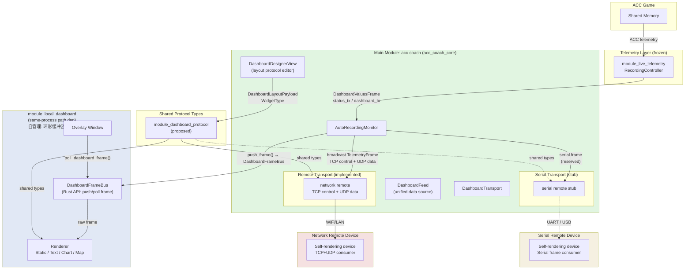

# ACC Coach Dashboard 架构设计

版本: 1.1
日期: 2026-06-26

---

## 1. 架构总览图



**各 transport 标注:**

| 链路 | 传输介质 | 协议/机制 | 说明 |
|---|---|---|---|
| acc-coach → local dashboard | 内存 | `DashboardFrameBus::push_frame()` (Rust API) + `poll_dashboard_frame()` (Tauri command) | 同进程，帧由 module_local_dashboard 管理，零拷贝 |
| acc-coach → network remote | TCP + UDP | `protocol-spec.md` | 公开 wire 协议，设备端独立实现 |
| acc-coach → serial remote | 串口帧 | `DashboardTransport` stub | 预留，低带宽编码 |

---

## 2. 模块边界清单

### 2.1 主模块 (acc-coach) 职责

1. **原始帧分发**: 从 `AutoRecordingMonitor` 获取 `DashboardValuesFrame`，
   调用 `DashboardFrameBus::push_frame()`（local）和 `DataSender::broadcast()`（remote）
   原样转发，不做任何加工（不累积历史、不映射字段名、不合并稀疏帧）。
2. **统一协议**: 维护 `DashboardItemSubscription` 订阅模型、`DashboardLayoutPayload`（含 `WidgetType`）和 `DashboardValuesFrame` 数据源定义。
3. **Dashboard 设计器**: `DashboardDesignerView` 提供可视化 layout 编辑，产出协议供各 dashboard 渲染端消费。
4. **Transport 端实现**: 提供 TCP+UDP remote（network）、`DashboardTransport` serial stub。
   Local 路径通过 `DashboardFrameBus`（由 `module_local_dashboard` 提供）分发帧。
5. **统一订阅计算**: 实现 `dashboard_subscriptions_for_active_dashboards`，将 local/remote/serial 所需的动态字段去重后同步给 `RecordingController`。

### 2.2 各 Dashboard 职责

| Dashboard | 渲染 | 数据消费 | 窗口/设备 |
|---|---|---|---|
| local dashboard | 自渲染（Static/Text/Chart/Map） | `DashboardValuesFrame` + layout props | overlay window（module_local_dashboard） |
| network remote | 自渲染 | TCP+UDP wire 协议 | 独立设备/项目 |
| serial remote | 自渲染 | 串口帧（预留） | 独立设备/项目 |

### 2.3 主模块不再做以下事情

- **不再做 chart 渲染**（`ChartWidget.tsx` 将从主模块移除）。
- **不再做 map 渲染**（`MapWidget.tsx` 将从主模块移除）。
- **不再做任何画面渲染**（所有 widget 的 Canvas/DOM 渲染由各 dashboard 端自行实现）。
- 不再直接读取 ACC shared memory（已由 `module_live_telemetry` 统一）。
- 不再查找 ACC 窗口 bounds（overlay 坐标系改为显示器范围）。
- **不再做历史累积**（`TelemetryHistory` 移除，各 dashboard 自行维护环形缓冲区）。
- **不再做字段名映射**（`friendly_to_raw_keys()` 移除，各 dashboard 自行维护映射表）。
- **不再做稀疏帧合并**（前端 `{...prev, ...nextFrame}` 逻辑下沉到各 dashboard 模块）。
- **不再提供 `get_live_dashboard_frame_with_history()`**（删除此 IPC，dashboard 从自有缓冲区查询历史）。

---

## 3. 统一数据协议

### 3.1 核心类型

```rust
// 数据源帧
pub struct DashboardValuesFrame {
    pub sample_tick: u64,
    pub timestamp_ns: u64,
    pub values: HashMap<String, f64>,
}

// 订阅项
pub struct DashboardItemSubscription {
    pub item_name: String,
    // 扩展字段预留
}

// Layout 载荷
pub struct DashboardLayoutPayload {
    pub canvas_width: u32,
    pub canvas_height: u32,
    pub static_image_base64: String,
    pub dynamic_controls: Vec<DashboardControl>,
}

// Widget 类型
pub enum WidgetType {
    Static,
    Text,
    Chart,
    Map,
}
```

### 3.2 统一订阅计算

所有 dashboard（local、network、serial）的动态控件所需的字段，必须通过统一的订阅计算函数转换成 `DashboardItemSubscription` 列表，再调用 `RecordingController::replace_dashboard_items` 同步给数据源。

参考 `docs/acc-coach/live-telemetry-api-boundary.md` 中定义的 `dashboard_subscriptions_for_active_dashboards`：

```rust
pub fn dashboard_subscriptions_for_active_dashboards(
    registered_layouts: &[RegisteredDashboardLayout],
    overlay_config: &LocalDashboardOverlayConfig,
    output_profiles: &OutputProfilesConfig,
) -> Vec<DashboardItemSubscription>;
```

要求：

- Local Dashboard、Remote Dashboard、Serial Dashboard 统一走同一套订阅计算。
- 去重相同 item。
- layout 切换、region 变化、output profile 变化后调用 `replace_dashboard_items`。

---

## 4. 传输层因介质而异

### 4.1 Local = IPC / 内存

- 机制: `DashboardFeed` 将 `DashboardValuesFrame`、layout、history、trackPoints 通过 React props 注入 `LocalDashboardOverlay`。
- 同进程，无序列化开销，低延迟。
- 主模块只负责数据准备和注入，不介入渲染。

### 4.2 Network = TCP Control + UDP Data

- 机制: 三层分离协议（Discovery / Control / Data）。
- 参考 `docs/acc-coach/public-protocol/protocol-spec.md`，该文档定义了完整的 wire 格式：
  - Discovery: UDP `20776`，设备 announce + 桌面端 probe。
  - Control: TCP `20778`，length-prefixed JSON frame，负责 handshake、pairing、layout 传输、stream profile、心跳。
  - Data: UDP `20779`，binary header + JSON/binary payload，负责高频 telemetry 流。
- **protocol-spec.md 是面向 network remote 设备端开发者的公开契约，保持稳定，主模块侧仅对齐共享类型，不修改 wire 格式。**

### 4.3 Serial = 串口帧 + 低带宽编码（预留）

- 机制: `DashboardTransport` trait 预留 serial 实现位。
- 串口帧复用同一套 `DashboardValuesFrame` + `DashboardLayoutPayload` 语义。
- 编码策略见第 8 节。

---

## 5. 交互方式

### 5.1 主模块 → Local Dashboard

```
acc-coach (Rust)
  |
  +-- AutoRecordingMonitor 获取 DashboardValuesFrame
  |
  +-- DashboardFrameBus::push_frame(&frame)  ← 仅分发，不加工

acc-coach Thin Shell (LocalDashboardOverlayWindow.tsx):
  - 窗口生命周期 (show/hide/bounds/follow ACC window)
  - 运行时上下文 (visible 状态、viewport 尺寸)
  - 不加载布局、不做字段映射、不做帧合并

module_local_dashboard (自管理):
    - 自行调用 IPC 加载元数据:
      * get_local_dashboard_overlay_config  →  叠层配置
      * list_registered_dashboard_layouts  →  布局定义
      * get_track_map / resolve_track_map  →  赛道地图
    - 自行调用 poll_dashboard_frame()       →  实时帧
    - 自身维护 per-field 环形缓冲区
    - 自身做布局格式适配 (新旧格式兼容)
    - 自身做字段名映射 (友好名 → raw key)
    - ChartWidget 从本地缓冲区读取历史并渲染
    - MapWidget 从本地缓存读取赛道数据并渲染
```

#### acc-coach Thin Shell 的 props

```typescript
// acc-coach 传给 module_local_dashboard 的 props 缩减为设备上下文
interface LocalDashboardOverlayShellProps {
    visible: boolean;           // 是否渲染
    viewportWidth: number;      // 窗口宽度
    viewportHeight: number;     // 窗口高度
}
```

所有其他数据由 `module_local_dashboard` 通过 IPC 自行获取。

### 5.2 主模块 → Network Remote

```
acc-coach (Rust)
  |
  +-- DashboardPublisher 按 output profile 下采样
  |
  +-- remote/ 协议栈
      - discovery.rs   → UDP probe/announce
      - control.rs     → TCP length-prefixed JSON
      - data.rs        → UDP binary packet
      - session.rs     → 设备状态机
  |
  +-- protocol-spec.md wire format
          |
          v
  Network Remote Device (independent project)
```

### 5.3 主模块 → Serial Remote（预留）

```
acc-coach (Rust)
  |
  +-- DashboardTransport::send_frame()
  |
  +-- serial stub（未实现）
          |
          v
  Serial Remote Device (independent project, reserved)
```

---

## 6. 渲染耦合盘点

### 6.1 主模块 src-ui 中需移走的渲染文件

| 文件 | 当前职责 | 迁移目标 |
|---|---|---|
| `src-ui/components/ChartWidget.tsx` | Canvas 图表渲染 | module_local_dashboard（由独立会话实现） |
| `src-ui/components/MapWidget.tsx` | 赛道地图渲染 | module_local_dashboard（由独立会话实现） |

### 6.2 module_local_dashboard 需补全的 widgetType 支持

当前 `module_local_dashboard` 已支持 Static 和 Text 控件的渲染。按 `WidgetType` 枚举定义，还需补全：

- **Chart**: 基于 `history` props 绘制 Canvas 遥测曲线。
- **Map**: 基于 `trackPoints` props 绘制赛道轨迹与车辆位置。

补全工作由用户拿更新后的 `local-dashboard-public-api.md` 契约去独立会话完成，本会话不涉及 `module_local_dashboard` 实现代码修改。

---

## 7. 各 Dashboard 契约文档归属

| Dashboard | 契约文档 | 文档性质 | 维护方 |
|---|---|---|---|
| local dashboard | `docs/module_local_dashboard/local-dashboard-public-api.md` | Crate API + 组件 props 契约 | module_local_dashboard |
| network remote | `docs/acc-coach/public-protocol/protocol-spec.md` | TCP+UDP wire 协议 | acc-coach（公开协议） |
| serial remote | 预留（后续单独出协议文档） | 串口帧 + 低带宽编码 | 待定义 |

**重点明确：protocol-spec.md 不是 local dashboard 的契约。**

- `protocol-spec.md` 面向的是 **network remote 独立设备端开发者**，定义了 Discovery/Control/Data 三层 wire 协议，端口、帧格式、状态机、错误码均针对 TCP/IP 网络环境。
- `local-dashboard-public-api.md` 面向的是 **acc-coach 主模块开发者**，定义了同进程内 Rust crate API 和 React 组件 props 契约，包括 `LocalDashboardOverlayConfig`、`LocalDashboardOverlayProps`、`LiveFrame` 等。
- 两者在数据语义层复用相同的 `DashboardValuesFrame` 和 `DashboardLayoutPayload` 概念，但传输机制和接口形态完全不同，不可混用。

---

## 8. Serial 预留设计

### 8.1 DashboardTransport Trait Shape

```rust
pub trait DashboardTransport: Send + Sync {
    /// 发送 layout 定义（低频，仅在 layout 变化时）
    fn send_layout(&self, layout: &DashboardLayoutPayload) -> Result<(), TransportError>;

    /// 发送数据帧（高频，按设备 Hz 下采样后）
    fn send_frame(&self, frame: &DashboardValuesFrame) -> Result<(), TransportError>;

    /// 发送历史/关键帧（可选，用于 chart/map 补全）
    fn send_keyframe(&self, frame: &DashboardValuesFrame) -> Result<(), TransportError>;

    /// 当前链路状态
    fn status(&self) -> TransportStatus;
}
```

### 8.2 Serial Stub 占位

```rust
pub struct SerialDashboardTransport;

impl DashboardTransport for SerialDashboardTransport {
    fn send_layout(&self, _layout: &DashboardLayoutPayload) -> Result<(), TransportError> {
        Err(TransportError::NotImplemented)
    }

    fn send_frame(&self, _frame: &DashboardValuesFrame) -> Result<(), TransportError> {
        Err(TransportError::NotImplemented)
    }

    fn send_keyframe(&self, _frame: &DashboardValuesFrame) -> Result<(), TransportError> {
        Err(TransportError::NotImplemented)
    }

    fn status(&self) -> TransportStatus {
        TransportStatus::Disabled
    }
}
```

### 8.3 低带宽编码策略建议

串口带宽远低于 WiFi，建议复用 network 协议中已定义的 `payload_type` 概念，采用 **delta + keyframe** 策略：

| payload_type | 含义 | 使用场景 |
|---|---|---|
| `0x01` | `telemetry_snapshot` | 初始连接、keyframe 间隔 |
| `0x02` | `telemetry_delta` | 高频数据，仅发送变化字段 |
| `0x03` | `keyframe` | delta 模式下周期锚点 |
| `0x04` | `layout_values` | 动态控件值更新 |

附加建议：

- 字段编码使用变长整数（如 LEB128）代替 JSON 字符串 key，进一步压缩。
- layout 仅在变化时通过 TCP-like 可靠通道发送，日常数据走单向 delta 帧。
- 设备端检测到 sequence gap 时不请求重传，等待下一次 keyframe（与 network remote 语义一致）。

---

## 9. 迁移路径

### Wave 1: 共享类型与主模块数据统一

1. 新建 `module_dashboard_protocol` 纯类型包（Rust + TypeScript 双端）。
2. 将 `DashboardItemSubscription`、`DashboardLayoutPayload`、`DashboardValuesFrame`、`WidgetType` 移入共享包。
3. 主模块 `dashboard_fields()`（`src/dashboard/output.rs:832`）输出统一为 `DashboardValuesFrame`。
4. 主模块 `AutoRecordingMonitor` 启用 `dashboard_tx` 并缓存最新帧。

### Wave 2: 主模块瘦身（移除数据加工）

1. 删除 `src/dashboard/history.rs` 中的 `TelemetryHistory`（各 dashboard 自行累积）。
2. 删除 `get_live_dashboard_frame_with_history()` IPC。
3. 删除 `friendly_to_raw_keys()` 函数。
4. `LocalDashboardOverlayWindow.tsx` 瘦身为 Thin Shell：
   - 移除帧合并、字段名转换、历史轮询逻辑
   - 移除 `overlayControl()`、`overlayLayout()`、`overlayLayouts()` 布局转换
   - 移除布局加载 (`list_registered_dashboard_layouts`)、track map 加载 (`get_track_map`)
   - 移除 session track name 解析
   - 移除 preview mode layout 重新加载
   - 仅保留窗口生命周期 + 运行时上下文判断
   - 仅传递 `visible`、`viewportWidth`、`viewportHeight` 三个 props
5. Recording loop 改为调用 `DashboardFrameBus::push_frame()`。

**依赖**: 需 `module_local_dashboard` 先完成 `DashboardFrameBus`、`poll_dashboard_frame()` 和元数据自加载（见 PRD `local-dashboard-self-managed-data.md`）。

### Wave 3: Network Remote 对齐

1. 主模块 `src/dashboard/remote/` 协议实现复用 `module_dashboard_protocol` 共享类型。
2. `protocol-spec.md` wire 格式保持不变，仅内部数据转换层对齐统一类型。
3. 不开发 network remote 设备端（用户选）。

### Wave 4: Local Dashboard 数据自管理（独立会话）

1. 用户拿 `docs/acc-coach/prd/local-dashboard-self-managed-data.md` 契约，
   在独立会话中开发 `module_local_dashboard`。
2. 实现 `DashboardFrameBus` Rust struct + Tauri command `poll_dashboard_frame`。
3. 前端实现 per-field 环形缓冲区、稀疏帧合并、字段名映射。
4. ChartWidget 改为从本地缓冲区查询历史。
5. 回归测试 overlay 完整功能。

### Wave 5: Serial Transport 实现（远期）

1. 实现 `SerialDashboardTransport` 串口 IO。
2. 定义 serial remote 专用协议文档。
3. 低带宽编码与 delta/keyframe 策略落地。

---

## 10. 协作模式说明

### 10.1 本会话完成的内容

- 本架构设计文档（`docs/acc-coach/dashboard-architecture.md`）v1.1 更新。
- 帧分发协议文档（`docs/acc-coach/public-protocol/dashboard-frame-distribution-protocol.md`）。
- module_local_dashboard 数据自管理 PRD（`docs/acc-coach/prd/local-dashboard-self-managed-data.md`）。
- Remote Dashboard 设备端数据自管理 PRD（`docs/acc-coach/prd/remote-dashboard-self-managed-data.md`）。
- 主模块侧共享类型包设计（`module_dashboard_protocol` 提议）。
- 主模块数据供给统一化（`DashboardFeed` 接口设计）。
- 主模块 `DashboardTransport` 抽象与 serial stub 设计。

### 10.2 由独立会话完成的内容

- **module_local_dashboard 数据自管理**: 用户拿 `docs/acc-coach/prd/local-dashboard-self-managed-data.md` 契约，在独立会话中完成 `DashboardFrameBus`、环形缓冲区、ChartWidget 改造等实现。本会话不直接修改 `module_local_dashboard` 代码（遵循 AGENTS.md 禁止项）。
- **Remote Dashboard 设备端**: 用户拿 `docs/acc-coach/prd/remote-dashboard-self-managed-data.md` 契约，在独立设备项目中完成数据自管理。

### 10.3 暂不开发的内容

- **network remote 设备端**: `protocol-spec.md` 已完整，设备端项目后续启动。主模块 `src/dashboard/remote/` 已有实现，仅对齐共享类型。
- **serial remote 实际通信**: 仅 trait + stub，不实现实际串口 IO。

### 10.4 禁止修改的模块

以下模块在本计划内**不做任何修改**:

- `module_live_telemetry`
- `acctlm_core`
- `ld_to_acctlm`

---

## 参考文档

| 文档 | 作用 | 本文引用方式 |
|---|---|---|
| `docs/acc-coach/live-telemetry-api-boundary.md` | module_live_telemetry API 边界与数据流设计 | 引用 `DashboardValuesFrame`、 `dashboard_subscriptions_for_active_dashboards` |
| `docs/acc-coach/public-protocol/protocol-spec.md` | network remote 三层 wire 协议 | 引用 Discovery/Control/Data 架构与端口，不修改 |
| `docs/acc-coach/public-protocol/dashboard-frame-distribution-protocol.md` | acc-coach 帧分发协议（帧总线定义、各路径分发方式、Dashboard 模块契约义务） | 替代本文第 5 节的详细交互描述 |
| `docs/acc-coach/prd/local-dashboard-self-managed-data.md` | module_local_dashboard 数据自管理 PRD（FrameAccumulator、环形缓冲区、ChartWidget 改造） | module_local_dashboard 开发者的需求文档 |
| `docs/acc-coach/prd/remote-dashboard-self-managed-data.md` | Remote Dashboard 设备端数据自管理 PRD（UDP 流接收、丢包处理、Chart 渲染） | Remote Dashboard 设备开发者的需求文档 |
| `docs/module_local_dashboard/local-dashboard-public-api.md` | local dashboard crate API + 组件 props 契约 | 引用 `LocalDashboardOverlayProps`、 `LocalDashboardOverlayConfig`，并扩展 chart/map 契约 |
